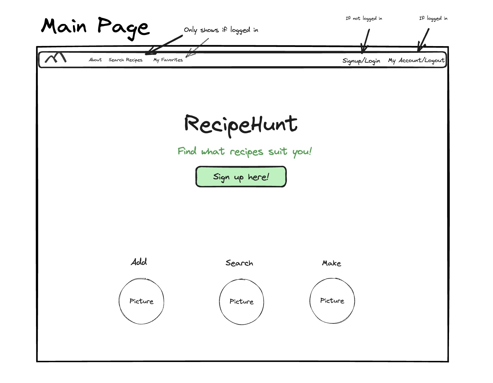
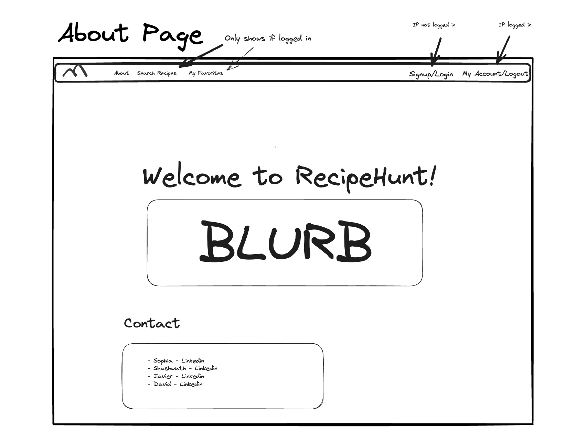
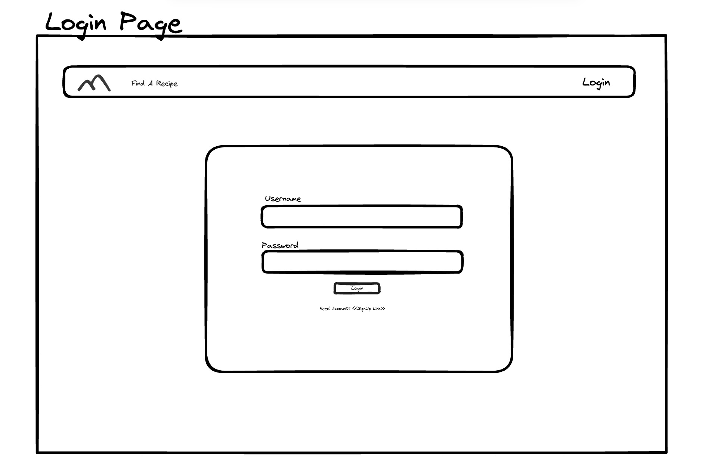
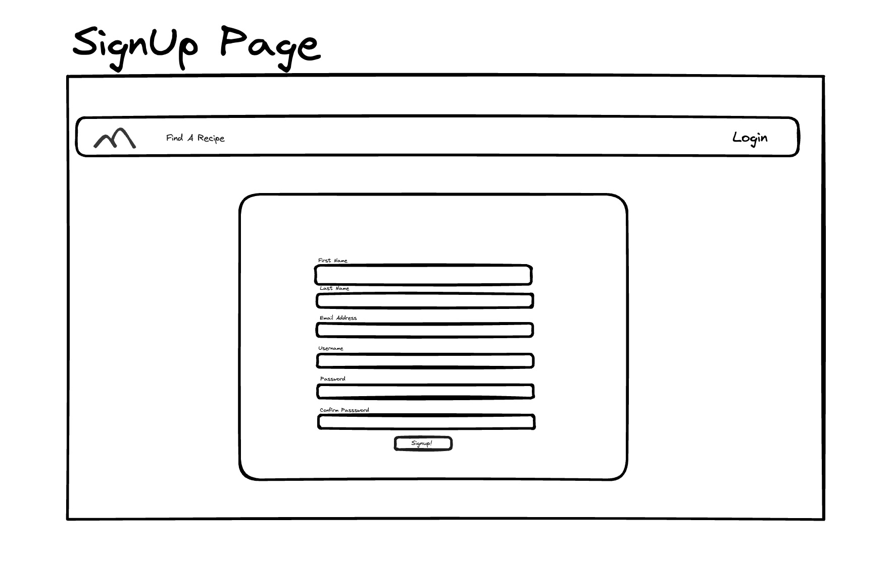
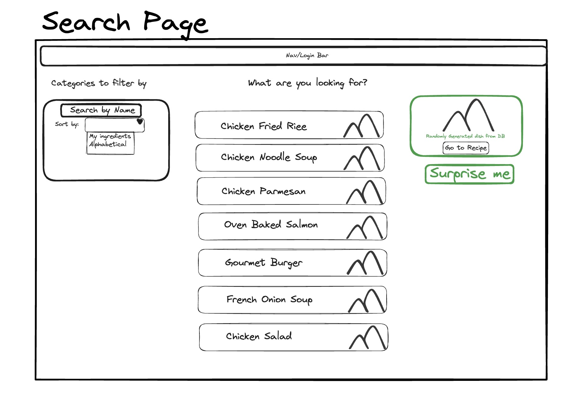
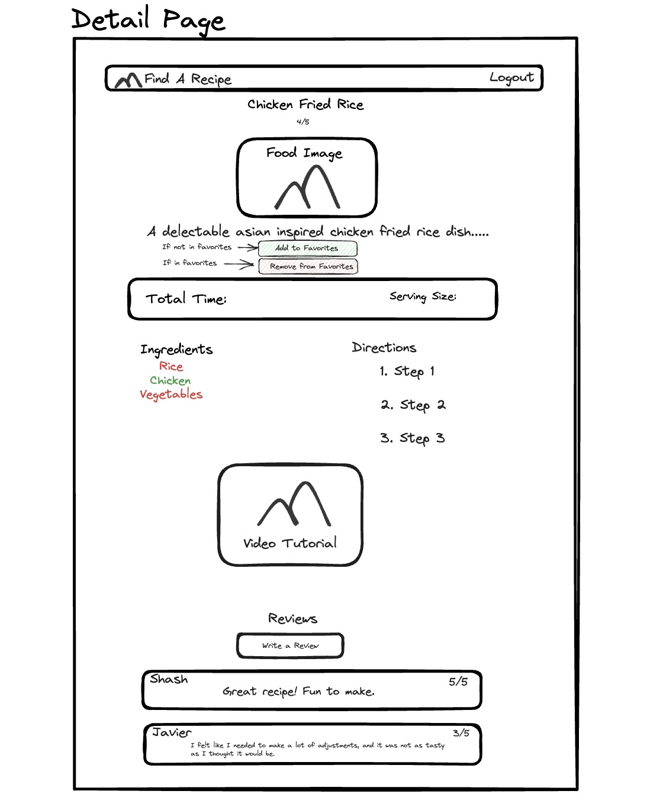
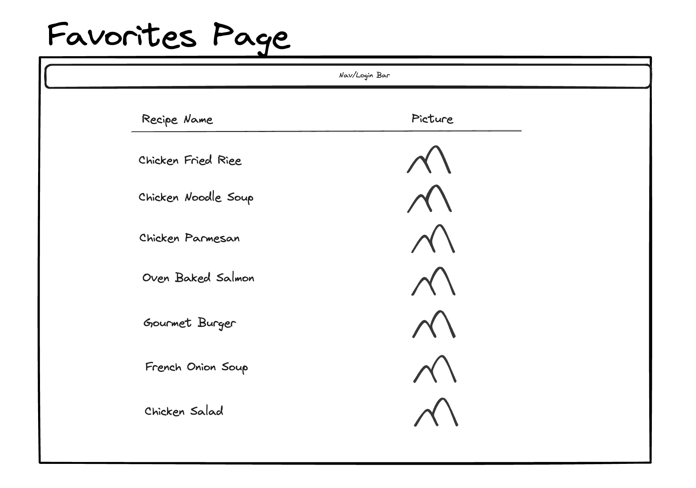
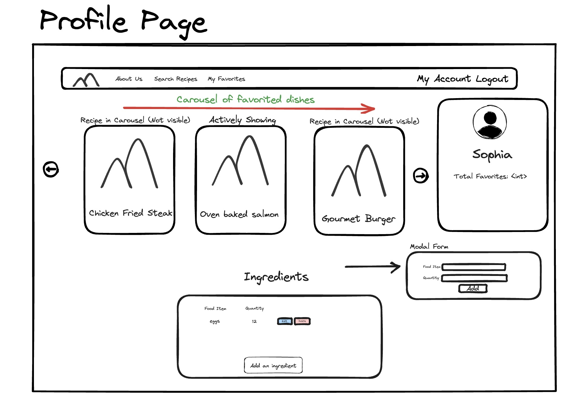

## Home Page

    - This page is the main page that shows when you open the website. It is also where users will be directed when you log in or sign up, or when you are logged out of your current account.

## About Page

    - This page contains a small blurb for the website along with the contact info for the creators: Sophia Tony-Egbuniwe, Javier Hernandez, Shashwath Nayak, and David Ra.

## Login Page

    - This page allows a user to log into their own profile. If a user does not have a profile, it has a link to the signup page.

## Signup Page

    - This page allows a new user to sign up for the website. It includes their first name, last name, email, a picture for their profile, a password, and a passwork confirmation.

## Search Page

    - This page allows users to search through the list of recipes currently on the website. It allows a user to search for a recipe based off name or key words, and it allows users to sort and filter recipes based off ingredients that they have chosen on their profile page or sort the recipes alphabetically. It also has a surprise recipe button that would allow a user to click and randomly select a recipe from the full recipe list.

## Recipe Details Page

    - This page has all the information on one recipe. It will show ingredients (either in red if their are not in your ingredients list or in green if they are), steps for the recipe, and a video tutorial if existing. There is also a button on each recipe page that allows one to add a recipe to their favorites list. At the bottom of the page, the user will have the ability to rate a recipe from 1-5 and can leave a review for the specific recipes that they are on.

## My Favorites Page

    - This page shows a list of favorites that a user has selected. Each recipe name is a link to that specific recipe page, and the list includes a picture of each recipe as well.

## Profile Page

    - The profile page includes information about the specific user. It will include a carousel with all of their favorited items, and it will also include their ingredients list. The ingredients list will have the ability to edit a specific ingredient, add ingredients, or delete ingredients off the list. This list will allows for the functionality on the search page to be able to filter and sort based off the list provided per specific user.

